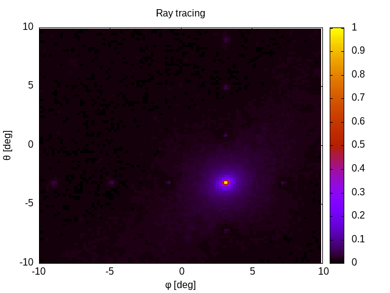
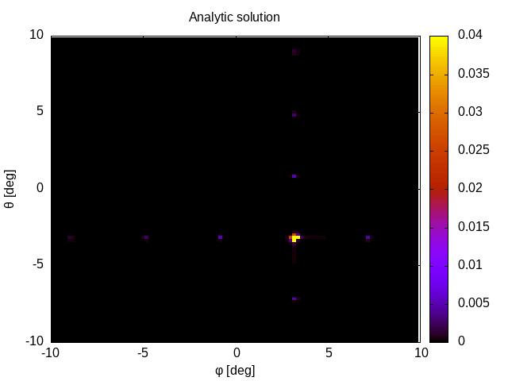

# Simulating the diffraction pattern of digital mirror devices

The source-code presented here has been used during the developement of algorithms to analytically
simlate the diffraction pattern of a digital mirror device (dmd).
This has been achieved by repdroducing the same diffraction patterns as presented in this [paper](https://doi.org/10.1101/797670) using a raytracing approach.
We compute the same diffraction pattern with two different approaches. The first approach is to perform a ray-tracing simulation. For each ray, we compute the
individual phase shift and add the corresponding complex amplitude to produce the diffraction pattern.
The second approach utilizes the algorithms developed in the paper to reproduce the same image.

The following two images show a comparison of the two appraches.

Please note, that the amplitude in of the main diffraction order is much larger, than the other orders. It takes a lot of rays to reproduce this difference of
the amplitudes using the ray-tracing approach. Therefore, the main spot is not as bright as in the analytic approach.

## Make it run
We use cmake to compile the code. First create a directy outside of the source directory. Afterwards call
`cmake path/to/source/folder` and then compile using `make`.
The main executable can be found in `run_raytracing`. See comments in [src/run_raytracing.cpp](src/run_raytracing.cpp) for further details. You may plot the
results using the gnuplot script [example_output/plot.gpi](example_output/plot.gpi).
